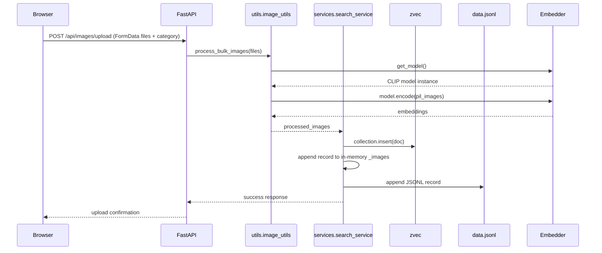

# Architecture Overview

## System Design

VectorGallery is designed as a local-first multimodal search engine where the persistent state is split between a durable document store and a fast vector index.

- `data.jsonl` is the canonical source of truth. Each record stores the image identifier, category, and base64 data URI.
- `zvec` is the runtime index that stores both metadata and `512`-dimensional CLIP vectors for nearest-neighbor search.

This dual-database pattern avoids split-brain scenarios by ensuring that all write operations persist through the same logical flow, and the startup path validates index consistency.

## Offline-First Model Loader

`utils/embedder.py` implements a singleton loader for the CLIP model:

- `HF_HUB_OFFLINE=1` is set before importing `SentenceTransformer`.
- `_model_instance` is stored as a module-level singleton.
- `get_model()` initializes the model only once per process, then returns the same object for all subsequent uses.

Why this matters:

- Prevents duplicate model loads and the associated memory pressure
- Avoids repeated network access during startup by relying on cached artifacts
- Ensures consistent embedding behavior across route handlers and batch pipelines

## Image Processing Pipeline

`utils/image_utils.py` is the single-pass image ingestion and embedding layer.

Key behavior of `process_bulk_images()`:

1. Accepts a mixed batch of `UploadFile` and `Base64Image` objects.
2. Reads raw bytes exactly once per input item.
3. Normalizes every image into a data-URI string for frontend compatibility.
4. Converts the raw bytes into a PIL `RGB` image when needed.
5. Collects all PIL images and performs one batch embedding call via `model.encode(pil_images)`.
6. Returns `ProcessedImage` objects with `id`, `base64_image`, `embedding`, and `category`.

This single-pass design minimizes intermediate memory churn and keeps the CPU/GPU embedding stage efficient.

## Dual-Database Write-Through

The system uses a write-through persistence strategy in `services/search_service.py`.

### `SearchService.add_images()` flow

- Receives `processed_images` from `process_bulk_images()`.
- Inserts each image into the `zvec` collection immediately.
- Appends each image metadata record to the in-memory `_images` list.
- Persists new records to `data.jsonl` in append-only mode.
- Updates category state for live filtering.

This means a write always touches both persistence layers in the same operation, preventing cases where search can return items not present in the primary JSONL store.

## Auto-Healing Startup Sync

At startup, `SearchService.load_data()` performs an integrity check:

1. Loads all JSONL records into memory and normalizes their base64 payloads.
2. Opens or creates the `zvec` collection.
3. Compares `zvec` document count against the number of loaded JSONL records.
4. If counts differ, the collection is destroyed and rebuilt from `data.jsonl`.

This auto-healing mechanism handles:

- partial writes to the vector index
- stale or deleted vector files
- mismatched state after a crash or manual file restore

If the counts match, the service skips re-embedding and preserves the existing optimized index.

## Frontend Contract and Data Flow

### Primary API endpoints

- `GET /api/images`
  - Returns `GalleryResponse` with all saved images, optionally filtered by category.
- `GET /api/search?q=...&topk=...`
  - Embeds the query live with CLIP and returns semantically similar images.
- `POST /api/images/upload`
  - Accepts multipart image files plus a category label.
  - Returns the count of images uploaded.
- `POST /api/search/image`
  - Accepts a multipart image upload for visual search.
  - Returns the top-K most similar images by embedding distance.

### User upload sequence

## FastAPI Lifecycle

`main.py` creates a single, process-scoped `SearchService` instance and injects it into `app.state`.

- On startup, `lifespan()` calls `load_data()` to populate `data.jsonl`, load categories, and validate the vector index.
- The same `SearchService` instance services all request handlers.
- This design keeps the runtime state consistent and avoids repeated reloads.

## Search Path

Two search modes support the same vector store:

- `SearchService.search()` embeds raw text with CLIP on demand and queries `zvec`.
- `SearchService.search_by_vector()` accepts an image embedding from the upload pipeline and queries `zvec`.

Both return records with `base64_image` and `category`, ensuring UI rendering is consistent.

## Why the pattern matters

- `data.jsonl` remains recoverable and human-readable.
- `zvec` remains fast and searchable without replacing the truth store.
- The startup reconciliation prevents split-brain between persistence and index state.
- The singleton model loader protects memory and removes repeated cold starts.
- Batch embedding keeps production performance predictable.
